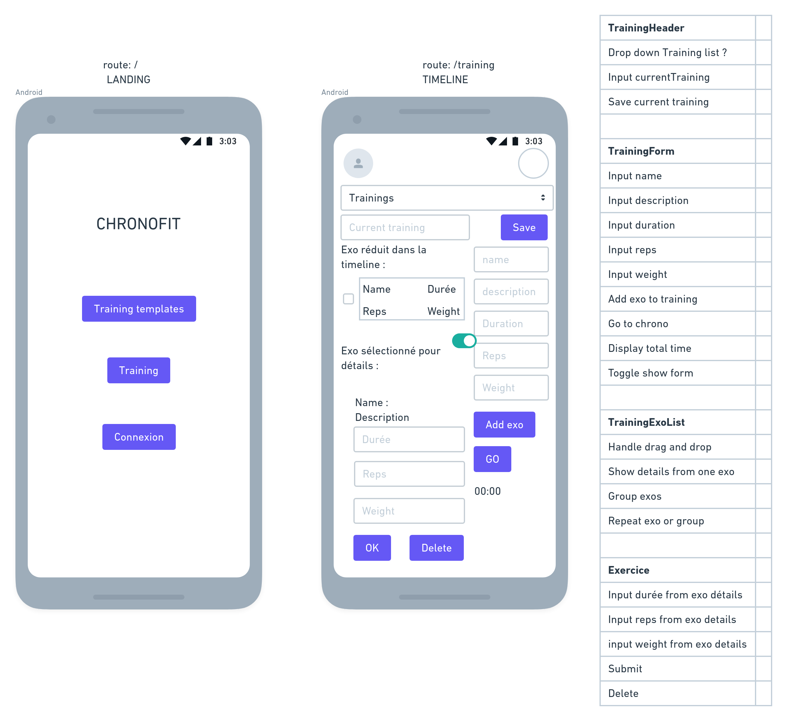

# JOURNAL CHRONOFIT-REACT

### 05/06/2022

Faire de roundMenu une modale -> ok
Passer ExoForm en modale :

- Dans vue Round -> ok
- Dans vue Training -> ok

Prochaines étapes :

Revoir ExoForm, faire wireframes ->
Revoir le css de ExoForm ->
Revoir RoundMenu, faire wireframes ->
Revoir le css de RoundMenu->

- Ajouter le bouton pour gérer son compte ->
- Test complet round + training + CRUD ->
- Deploy version ->
- Réaliser et relier les autres vues:
  - StatsView : Stats et graphs,
  - (pas MVP) Diar---View : calendrier en lien avec le ou les entrainements réalisés.

### 04/06/2022

Ajout de la fonction "Création de rounds réutilisables":

- vider exoForm reducer après création d'un exo -> ok
- Ne pas afficher roundMenu si CustomRound -> ok
- Fix timecap et type d'un training -> ok
- commit -> ok
- café ! -> ok
- Possible de charger un CustomRound dans un training:
  - Ajouter une entrée au RoundMenu -> ok
  - Affiche un select des localRounds -> ok
  - Le select dispatch ADD_LOCAL_ROUND_TO_LOCAL_TRAINING -> ok
  - Ajoute le round dans le training -> ok
- FIX: Position modale delete round dans TrainingView -> ok

### 02/06/22

Ajout de la fonction "Création de rounds réutilisables":

Créer les actions liées aux rounds + reducer:

- setCustomRoundIteration -> ok
- deleteExoFromCustomRound -> ok
- moveExoInCustomRound -> ok

### 01/06/2022

Ajout de la fonction "Création de rounds réutilisables":

Créer les actions liées aux rounds + reducer:

- getLocalRounds -> ok
- setCustomRound -> ok
- getCurrentCustomRound -> ?
- setCustomRoundName -> ok
- createLocalRound -> ok
- deleteCustomRound -> ok
- addExerciceToCustomRound -> ok
- putExoFormInRound -> ok
- showExoFormCustomRound -> ok
- showExoInCustomRound -> ok

### 31/05/2022

Ajout de la fonction "Création de rounds réutilisables":
Finir la mise en place des composants :

- Enregistrement d'un round en local -> ok
- Le select affiche les rounds récup en local -> ok
- Modifier un exercice du round :
  - Créer le container "ExoInRoundContainer" -> ok
  - Renommer "ExoInListContainer" en "ExoInTrainingContainer" -> ok
    - Ca fonctionne dans la vue Training -> ok
  - Renommer shoExoForm() en showExoInTrainingForm() -> ok
    - Ca fonctionne dans la vue Training -> ok
  - Mettre en place "ExoInRoundContainer" -> ok
    - Ca fonctionne dans CustomRoundView -> ok
  - Créer showExoRoundForm() -> ok
    - Ca fonctionne dans CustomRoundView -> ok

### 29/05/2022

Ajout de la fonction "Création de rounds réutilisables":
Finir la mise en place des composants :

- Adapter CMForm -> ok
- Créer RoundCustomManagerContainer -> en cours
- Créer les fonctions pour gérer les rounds en local storage -> ok
- Ajout d'un exercice au round -> ok

### 25/05/22

Ajout de la fonction "Création de rounds réutilisables":
Remplir ExoForm avec les bonnes données -> ok
Finir la mise en place des composants -> en cours
Créer les actions liées aux rounds + reducer -> en cours

### 22/05/2022

Ajout de la fonction "Création de rounds réutilisables":
Faire un MW pour mettre le contenu d'exoForm dans l'action -> ok
Finir la mise en place des composants -> en cours
Créer les actions liées aux rounds + reducer -> en cours

### 21/05/2022

- Finir la mise en place des composants -> en cours
- Créer les actions liées aux rounds + reducer -> en cours
- Faire un reducer pour ExoForm -> ok

### 19/05/2022

Delete d'un exo dans un trainingDone -> ok
Upload du training modifié à la validation -> ok
Confirmation du succes de l'upload -> ok
Demande si upload quand quitte avec modifs sans valider -> ok
Ajout de la fonction "Création de rounds réutilisables":

- Créer un route "rounds" -> ok
- Afficher les composants de base :
  - Refacto pour réutilisation de CTMForm, CTMOptions et CustomTrainingManager en CMForm, CMOptions et CustomManager -> ok

### 16/05/2022

- Faire un container EndTrainingExoTabContainer et un TrainingDoneExoTabContainer et passer les props au composant ExoLine -> ok
- Action / reducer pour lier les valeurs des champs -> ok

Aussi bien galéré pour trouver une méthode pour faire le render des exos, pour mémoire les props des objets à n+2 ne provoquent pas de render => j'utilise une prop render dans le state mise à jour et fournie au container quand render nécessaire.

### 12/05/2022

Faire update depuis recap trainings:

- Ajout bouton -> ok
- Action/reducer pour modifier les champs -> ok

### 10/05/2022

Route api -> ok (delete /chronofit/training/:id)
Deploy version -> ok (FIX uRLs in setting.js)

### 08/05/2022

Affichage button historique sur landing fonction de connexion -> ok
Affichage info "connecté" sur Landing -> ok
Affichage controles sur EndTrainingModal selon state.isUserLoggued -> ok
Modification queries, utiliser l'id du user loggué en READ -> ok
Modification queries, utiliser l'id du user loggué en WRITE -> ok
Affichage confirmation ou erreur après insert (alert ?)-> ok
Retour accueil après enregistrement training -> ok
Faire DELETE depuis récap trainings:

- Bouton -> ok
- Action, MW -> ok

### 07/05/2022

retour auto à chronofit après identification ok -> ok
retour auto à chronofit après création d'un compte -> ok
Deploy version -> ok

### 05/05/2022

- Mettre une authentification par token en lien avec auth.ikodi.eu :
  - Ajouter un bouton de connexion / creation de compte -> ok
  - récupérer un token si authentification ok -> ok
  - Création du state authentification et le remplir avec le retour de auth-> ok
  ```javascript
    {
      id: -1,
      nickname: "",
      email: "",
      isUserLoggued: false,
      }
  ```
  - Affichage bouton connexion / déconnexion selon state.isUserLoggued -> ok

### 01/05/2022

- Ajouter tri par date -> ok
- Ajouter tri par nom -> ok
- Fix affichage Landing après click sur chrono sans entrainement sélectionné -> ok, ct une mauvaise url dans CTMOptions.js
- Ajouter le type de training :
  - A la création -> ok
  ```javascript
  ["FOR TIME", "EMOM", "AMRAP", "MAX REPS"];
  ```
  - Affichage à la fin de l'entrainement -> ok
  - A l'écriture en BdD -> ok
  - Affichage dans le tableau récap -> ok
- Ajouter tri par type -> ok

### 29/04/2022

- Affichage des détails et exos d'un training:
  - Composant TrainingRecapDetails :
    - Création d'un nouveau reducer / actions-> ok
    - Création container / composant / modale -> ok
    - Reste à afficher les détails dans la modale -> ok
  - Améliorer le format de la date -> ok

### 26/04/2022

- Modale de validation de l'enregistrement -> ok
- SearchTrainingsView, affiche les entrainements réalisés avec tris:
  - Vue principale et affichage des entrainements en DB -> ok
  - Affichage des détails et exos d'un training:
    - Composant TrainingRecapDetails -> En cours, création d'un nouveau reducer / actions / container / composant / modale, reste à afficher les détails dans la modale.

### 24/04/22

EndTrainingView, récap fin entrainement :

- Bouton enregistrer en DB -> ok (d'avant),
- Bouton modifier / annuler les modifs -> ok (d'avant),
- Bouton supprimer une ligne (si en modif)-> ok

### 23/04/22

Revoir la forme de l'objet stocké et de l'objet renvoyé, voir si possible de stocker et renvoyer sous la forme:

```javascript
{
  id: 1,
  user_id: 50,
  name: 'test',
  duration: 6,
  timecap: 0,
  exos: [
      {
        name: 'exo 1',
        description: 'desc de l\'exo 1',
        duration: 1.9,
        reps: 2,
        weight: 2
      },
      {
        name: 'exo 2',
        description: 'desc de l\'exo 2',
        duration: 1.9,
        reps: 3,
        weight: 0
      },
      {
        name: 'exo 2',
        description: 'desc de l\'exo 3',
        duration: 1.9,
        reps: 3,
        weight: 0
      }
    ],
  created_at: '2022-04-18T17:51:22.232Z'
},
```

--> ok, colonne DB passée en type json[]

### 20/04/22

- créer gestion evt dans app chronofit + affichage des entrainements en DB -> ok

### 18/04/22

- Création d'un table trainings dans base authikodi avec contrainte foreign key sur users.id + script de création -> ok
- Relier l'écriture en DB depuis le front :
  - créer endpoint POST dans app auth -> ok (POST /chronofit/new-training)
  - créer gestion evt dans app chronofit + ecriture des entrainements en base -> ok
- Relier la lecture en DB depuis le front :

  - créer endpoint GET dans app auth -> ok pour GET /chronofit/trainings
  - créer vue affichage des trainings:
    - Nouvelle entrée du menu "Entrainements fait" -> ok
    - Dans "Entrainements fait", créer l'affichage de la liste des entrainements, plus tard les options de tri -> ok
  - créer gestion evt dans app chronofit + affichage des entrainements en DB -> TODO

### 14/04/22

Fix Issue #4, l'input "roundIteration" perd le focus -> ok (géré en conditionnant sortable.js au focus sur l'input),
Ajout d'un 'recordTrainingBackup' dans le state pour pouvoir annuler les modifs -> ok
Bouton d'annulation des modifs visible si en mode 'modif' -> ok
version poussée sur aws -> ok

### Le 11/04/22

Créer la timeline à enregistrer -> ok (trainingRecord dans le state readTraining, avec composant / container / action / reducer et input reliés pour modif, la totale !)
Prévoir la possibilité d'annuler les modifs avant l'upload.

### Le 10/04/2022

Passer le tableau dans EndTrainingModal de ReadTrainingView -> ok
Ajout boutons de ctrl à EndTrainingModal -> ok

### Le 09/04/2022

Composant vue EndTrainingViewModal -> en cours
Amélioration composant AppNav, suppression du container -> ok

### Le 07/04/2022

Création composants vue EndTrainingModal -> en cours

### Le 06/04/2022

Liste des exos suivis en stats : - GYM : - HSPU, - Dips, - Pistols, - Tractions strictes, - Tractions keeping, - Tractions butterfly, - Pompes strictes, - Pompes prise serrée, - Pompes australiennes, - Pick Push Up, - Muscle Ups, - HALTERO: - Back Squat, - Front Squat, - Fentes, - Squat Snatch, - Squat Cleans, - Clean and Jerk, - Deadlifts, - Thrusters, - Bench Presse,
CARDIO - CORE - AUTRE: - Double Under, - Wall Balls, - Sit Ups, - KB Swings,

Vues à créer :

- EndTrainingView : Récap fin entrainement avec RUD,
- SearchTrainingsView : Entrainements réalisés avec tris,
- StatsView : Stats et graphs,
- DiaryView : calendrier en lien avec le ou les entrainements réalisés.

Début wireframe EndTrainingView -> ok

### Le 05/04/2022

Je reprends ce jour le développement de l'application en tant que "side project", peu de temps à lui consacrer mais toujours une pratique régulière du cross-training. Par ailleur cette petite app est bien utile quasi au quotidien, ne lui manque que les fonctionnalités de stockage des résultats des trainings puis de stats.
Egalement des améliorations ergonomiques sont à envisager.

Que du plaisir pour la suite, à prévoir :

- Avoir une réflexion sur les stats attendues :
  - Résultats par période de temps (aujourd'hui, 7 derniers jours, 30 derniers jours, 365 derniers jours, total) :
    - Durée d'entrainement,
    - Nombre d'entrainements total,
    - Nombre d'entrainements par nom,
    - Quantité de reps ou durée par type d'exercice (regroupé par poids),
    - Prévoir des graphs d'évolution, date de début et de fin par select, unité de temps pour regroupement (semaine, mois, année),
- Après réflexion , rédiger la logique attendu pour le CRUD des entrainements.
  - Faire une liste d'exercices qui seront suivis en stats (nom, poids, description), disponibles dans un select dans le formulaire CustomTraining,
  - CRUD :
    - Create : Ecriture du state "timeline" "aplatit ou déplier ?" en NoSql après modif et/ou validation par utilisateur en fin de training,
    - Read / Update / Delete : Une même vue affiche, permet de modifier ou supprimer l'entrainement affiché,
- Ensuite, définir les nouvelles vues nécessaires :
- Réaliser les wireframes, (récap fin entrainement avec possibilité de modif puis validation, affichage des entrainements réalisés et tris, page avec stats et graphs, calendrier en lien avec le ou les entrainements réalisés ce jour là...)
- Réaliser la vue récap en fin de training pour l'écriture dans un premier temps,
- Mettre en place la base NoSql et la relier au front,
- Réaliser et relier les autres vues,
- Mettre une authentification par token en lien avec auth.ikodi.eu.

### Le 03/05/2021, 1h avant la réunion de projet TeacCup

Faire des inputs controlés dans le ExoInListMenu

### Le 02/05/2021

Gérer le toggle du ExoInListMenu => ok.
Moins facile à gérer que je ne pensais, il a fallut ajouter une prop index à chaque exo dans la prop exoList du state.

Voir comment gérer le D&D, à l'ancienne en codant les events et récup du contenu du composant "TrainingExoList" au "onDrop()" ? Ou alors un package qui va bien avec React ?

Voir [react-dnd](https://react-dnd.github.io/react-dnd/about) il semblerait que ce soit une librairie qui laisse pas mal d'autonomie.
A commencer à mettre en place quand les fonctionnalités update et delete d'un exo via son menu déplié seront ok.

A garder à l'esprit les fonctionnalités à venir :

- Possibilité d'ajouter un ou plusieurs composants "Round" au training. Ce composant est une liste qui contiendra des exos.
- Il doit être possible de répéter la lecture des exos dans le "Round" un nombre de fois donné.
- On doit pouvoir faire un drag d'exo d'un parent vers un enfant et vice-versa, c'est à dire remplir ou vider un round avec les "ExoInList" déjà créés.
- On doit pouvoir modifier l'ordre des exos dans "TrainingExoList" et dans "Round".

```javascript
// exemple de state à re-réfléchir
state.training = {
  // Le state 'training' contient un training à la fois dans sa prop 'currentTraining'.
  currentTraining: {
    // Le currentTraining est un objet récupéré dans l'API, il doit représenter tous les paramètres d'un training.
    id: 1,
    name: 'training test',
    // Un training contient des 'rounds', chacun contenant une liste d'exercices et le nb de fois qu'il doit être répété.
    roundList: [
      {
        // Un même round peut être répété plusieurs fois.
        roundRepeat: 1,
        roundMenuIsVisible: false,
        // Un round contient un ou plusieurs exos
        roundExoList: [
          {
            // Un exo a des caractéristiques permettant de déclencher un chrono et/ou d'enregistrer ces infos en fin de training
            name: 'Tractions strictes',
            description: 'pas de description',
            duration: 60,
            reps: 10,
            weight: 0,
            menuIsVisible: false
          },{
            name: 'Pompes diamant',
            description: 'pas de description',
            duration: 60,
            reps: 10,
            weight: 0,
            menuIsVisible: false
          }
        ]
      }, {
        roundRepeat: 5,
        roundMenuIsVisible: false,
        roundExosList: [
          {
            name: 'Tractions strictes',
            description: 'pas de description',
            duration: 60,
            reps: 10,
            weight: 0,
            menuIsVisible: false
          },{
            name: 'Pompes diamant',
            description: 'pas de description',
            duration: 60,
            reps: 10,
            weight: 0,
            menuIsVisible: false
          }
        ]
      }
    ]
  },
  exoForm: { ... }
}
```

Et quand ça c'est ok, on passe à la lecture de la liste d'exos...

Next => update et delete depuis "ExerciceInListMenu".

### Le 01/05/2021 t= 3h

Tel la tortue qui avance lentement mais sans faillir vers son objectif...

- Fait tous les champs contrôlés du composant 'TrainingForm', création d'un composant 'Field', actions / actionMaker et reducer ok !
- Gérer la soumission de ce formulaire, doit ajouter un objet dans le state 'training.exoList' => ok + vérif du type et non vide
- Revoir l'organisation du composant 'ExerciceInList' + faire le composant 'ExerciceInListMenu' => ok.

Next: Gérer le toggle du ExoInListMenu

### Le 29/04/2021 t= 1h

Après une journée bien remplie sur le projet Oclock "TeaCup".
1h pour une action :

- Afficher les composants ExerciceInList (hydratés) d'après un fake state => ok en pile 30mn !

Next : Essayer d'ajouter un exo dans le state à l'aide du formulaire et donc l'afficher ?

### Le 27/04/2021 t= 1h

Le matin 1h avant le début d'Oclock.
actions :

- HIDE_MENU affiche / cache le menu de navigation principal => ok.

Perte de temps à cause de l'oubli de l'import du container à la place du component dans le parent... un classique, juste perdu 20mn cette fois-ci...

Next : Une autre action

### Le 26/04/2021 (t=2h).

Poursuite du css des composants de base de la vue "/training".
Les composants principaux sont en place, prochaine étape les premières actions (yes !).

PS: Le projet de fin de formation O'clock commence demain, donc niveau temps c'est pas gagné...

### Le 25/04/2021 (t=4h).

Le premier jet fonctionnel de l'API est réalisé, aujourd'hui préparation de l'app frontend avec installation et paramétrage de React + Redux => ok.

Etape wireframe, pour l'instant je cherche à rendre une interface avec une zone de formulaire pour interroger l'API + une zone pour afficher les réponses de l'API.
J'utilise [whimsical](https://whimsical.com/wireframes-58sAibeYwDaieCC1NRUd4i).
Dans le whimsical, j'ai commencé à lister les actions dont je pense avoir besoin.

Une page d'accueil minimum est mise en place.
La page "/training" est débutée, beaucoup de css à faire


